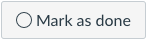

# Welcome to Prework!

Welcome to Flatiron School! We're thrilled that you've joined our community of learners!

## Goals of Prework

We've set up a "prework" course for you to complete before your first day of the Data Science bootcamp.

This material is intended to help you prepare for the program, with an introduction to both the **technical content** and the **delivery format** you'll be using at Flatiron School.

Many people in our program have already spent some time dabbling with coding and data analysis by using the amazing and plentiful resources all around the internet. In developing the content here, though, we make no assumptions about background. This prework content is designed for those who have analytic ability but not any specific coding skill. Lessons build off each other, providing the tools and concepts necessary to complete future lessons.

What we don't do, however, is dumb anything down. We believe in your infinite capacity to learn. We do our best to offer a curriculum that is clear, digestible, engaging, challenging, and deep. The curriculum you'll encounter at Flatiron School is rigorous and will demand that you be patient, resourceful, and gritty.

From the beginning, we'll make sure you have the support and tools you need; you just need to bring the grit.

### Technical Content

The prework course focuses on foundational content that comes up again and again in the Data Science program:

 - Python fundamentals
 - Descriptive statistics
 - Python libraries (NumPy and Matplotlib) for numerical computing and data visualization

Working through this prework material is not *required*, but it is **extremely** highly-recommended. When we ask alumni and current students what they wish they had done differently, one of the most common answers is not investing enough time in these foundational skills!

If you're getting stuck, keep in mind that we will also cover these topics in the first week or so of the Data Science program. Make sure you keep notes on what was confusing, and prepare to ask questions when the program starts.

### Delivery Format

In addition to covering technical topics, the prework is also intended to help you orient yourself to our curriculum delivery format.

In general, think of the online material as the "textbook" that you'll read before lectures and use to practice your Data Science skills.

Typically when learning something about code, you have to first deal with configuring your computer, getting it set up to work with the programming language you're writing in. This is often referred to as *setting up your environment*. You will have to do this eventually, but for now, **Canvas + IllumiDesk** will provide the environment you need to get started. We will give you a place to code within the browser; you get to focus on coding, not setup.

The next lesson will cover how to use Canvas + IllumiDesk, including the different types of lessons, how to open lessons in IllumiDesk, and how to view solution code.

For now, all you need to know is that every time you complete a lesson on Canvas — including this one! — you should click the "Mark as Done" button button on that page, so we can track your progress.

Before clicking, the button should look like this:



After clicking, it should look like this:


## Learning Methods

Here are some best practices to follow when working through this material:

- Work through each section, **enough that you can remember the material**, before moving on to the next section. **This may require repeating specific labs**.  

- Type every line of code you read or write 5 separate times.  (This may seem repetitive or unnecessary, but a large part of coding is getting the "muscle memory" of specific code into your fingers!)

- Say out loud what each piece of code is doing.  Part of learning to code is seeing the narrative of what is going on instead of just lines of specific instructions.
  - For example, for ```x = [5,6,7]``` you would say, out loud, "a list of integers from 5 to 7 is assigned to a variable named 'x' "
    
- Check the solutions only when you're done with the lab.  Remember, getting stuck and working through individual pieces of code and concepts is part of the process.  
    
- If you can't figure out why your code isn't working, look back to the section of prework that teaches that code, or try googling for information about the specific syntax you're trying to use.  ("90% of programming is googling StackOverflow").  
    
- If you get completely stuck and need to check the solutions to move forward, just look at the specific solution for the piece you got stuck on, instead of reading the solutions for the entire lab.

- For every solution you see, type out the code 5 times and say what the code is doing out loud!

- In coding in general and Python specifically, there are lots of ways to accomplish any given task.  It is a common occurrence to encounter code in the solutions that accomplishes the same result as the code you wrote but in a different way.  Your code isn't necessarily wrong just because it's different from the solution!  Consider why the solution code might be written differently than your code, even though it accomplishes the same thing.  
  
## Recap

In this prework course you'll be introduced to some of the technical content and the delivery format used in the main Data Science course.

Not only does completing the prework allow for an easier adjustment to the first few weeks, it also provides a solid foundation that allows better progress through the more-challenging material later on in the bootcamp, and ultimately to have a better capstone project to show to potential employers.

Be intentional with your strategy as you move through the material, particularly how you use the solution code. We'll explain how to access that solution code in the next lesson.

Enjoy the prework, and good luck! 
